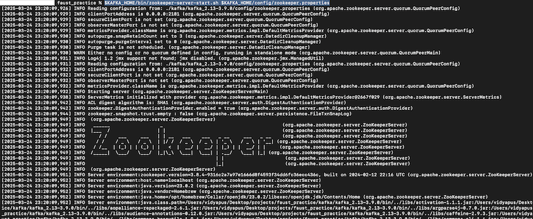

# faust_practice
Faust -- Python Stream Processing Library

This library adapts ideas from Java-based Kafka Streams to Python for stream processing.
Kafka is the underlying message system of *Faust*.

Note:  [Faust](https://faust.readthedocs.io/en/latest/) has not beeen updated for more than 2 years now.
But, there is a fork called [faust-streaming](https://github.com/faust-streaming/faust) which is updated at least 4 months ago.

However, I would start practicing with the Faust native library because of its popularity.

The goal is to overcome the limitation that streaming libraries not as much popular with
Python unlike the machine learning and data mining libraries.
One of interesting articles regarding the same is available at [medium.com](https://medium.com/data-science/stream-processing-with-python-kafka-faust-a11740d0910c).


# Setup Kafka
Before running the Faust App, Zookeeper and Kafka needs to be run. The steps are as follows (in case you are using any platform other than Mac, please follow their corresponding steps):
- First download Kafka (which also includes Zookeeper in it). In my case, I downloaded it from [apache-kafka-for-mac](https://learn.conduktor.io/kafka/how-to-install-apache-kafka-on-mac/).
    Where to download to?:
    - I created a folder named *kafka* in the root directory (that is, the folder containing this *README.md* file). I also ensured to remove this folder from tracking (that is, added kafka/*  to .gitignore).
    - [Downloaded](https://kafka.apache.org/downloads) the binaries of version 3.9.0 (filename: *kafka_2.13-3.9.0.tgz*) into *kafka* folder and extracted into the same *kafka* folder.
    - Note: Kafka version 4.0.0 is also available for download, but Zookeeper has been removed in this version as Apache Kafka 4.0 only supports KRaft mode. TO read more about it, please refer to [Kafka upgrade notes](https://kafka.apache.org/documentation/#upgrade_4_0_0).
- Set KAFKA_HOME path (path of the extracted kafka files)
    ```bash
    export KAFKA_HOME=./kafka/kafka_2.13-3.9.0
    ```
- (If not already installed) install openjdk (via commandline)
    ```bash
    brew install openjdk
    ```
    Then,
    - for the system Java wrappers to find this JDK, symlink it by executing
        ```bash
        sudo ln -sfn /opt/homebrew/opt/openjdk/libexec/openjdk.jdk /Library/Java/JavaVirtualMachines/openjdk.jdk
        ```
    - if you need to have openjdk first in your PATH, run:
        ```bash
        echo 'export PATH="/opt/homebrew/opt/openjdk/bin:$PATH"' >> ~/.zshrc
        ```
    - for compilers to find openjdk, you may need to set:
        ```bash
        export CPPFLAGS="-I/opt/homebrew/opt/openjdk/include"
        ```
- Run Zookeeper
    ```bash
    $KAFKA_HOME/bin/zookeeper-server-start.sh $KAFKA_HOME/config/zookeeper.properties
    ```
    The sample output should look something like 
- Run Kafka
    ```bash
    $KAFKA_HOME/bin/kafka-server-start $KAFKA_HOME/config/server.properties
    ```
    The sample output should look something like 

# How to Run it?
- Install the packages and dependencies from *requirements.txt* from commandline using
```bash
pip install -r requirements.txt
```

## Terminologies
- **Stream**: unbounded data that is accessible over the time.
- **Event**: details of some incident packed into a self containing object.
- **Producer**: one that produces the event, such as sensors or web logs.
- **Consumer**: one that consumes the events generated by the producer.
- **Message broker**: a mechanism where producers write their messages and accordingly it notifies the corresponding consumers to receive these messages.
- **Stream processing**: operate on the stream data to store it in database or visualize it.
- **Stream analytics**: aggregate the sequence of event stream data such as to count the number of events in last one minute or, some window time.
    - **Tumbling window**: non-overlapping window over the stream
    - **Hopping window**: overlapping window over the stream
- **Straggler events**: events that are yet to be be received for stream window processing.
- **zookeeper**: a centralized service provided by apache to keep track of Kafka topics and Kafka cluster nodes; allows simultaneous reads writes from multiple clients. Summarily, it provides synchronization within the distributed system.


